<a rel="license" href="https://creativecommons.org/licenses/by-nc-sa/4.0"></a>

## The CPTAC A vs B dataset

Our first case-study is a subset of the data of the 6th study of the
Clinical Proteomic Technology Assessment for Cancer (CPTAC). In this
experiment, the authors spiked the Sigma Universal Protein Standard
mixture 1 (UPS1) containing 48 different human proteins in a protein
background of 60 ng/μL Saccharomyces cerevisiae strain BY4741 (MATa,
leu2Δ0, met15Δ0, ura3Δ0, his3Δ1). Two different spike-in
concentrations were used: 6A (0.25 fmol UPS1 proteins/μL) and 6B (0.74
fmol UPS1 proteins/μL) [5]. We limited ourselves to the data of
LTQ-Orbitrap W at site 56. The data were searched with MaxQuant
version 1.5.2.8, and detailed search settings were described in
[@goeminne2016]. Three replicates are available for each
concentration.

- The raw data files can be downloaded from 
  https://cptac-data-portal.georgetown.edu/cptac/public?scope=Phase+I
  (Study 6)

- The MaxQuant data can be downloaded [zip file with 
  data](https://github.com/statOmics/PDA25EBI/archive/refs/heads/data.zip).
  The peptides.txt file can be found in 
  `data/quantification/cptacAvsB_lab3`.

## Installation instructions and setup

You can find the installation instructions for all required software
to run this exercise in [software](./software.html). This will 
install:

- R and RStudio
- `QFeatures` to read and process mass spectrometry (MS) quantitative 
  data
- `QFeaturesGUI` the graphical user interface (GUI) to QFeatures
- `msqrob2` to perform robust statistical inference for quantitative MS 
  proteomics
- `msqrob2gui` the GUI to msqrob2

Upon installation 

1. Open Rstudio, you will see the following window

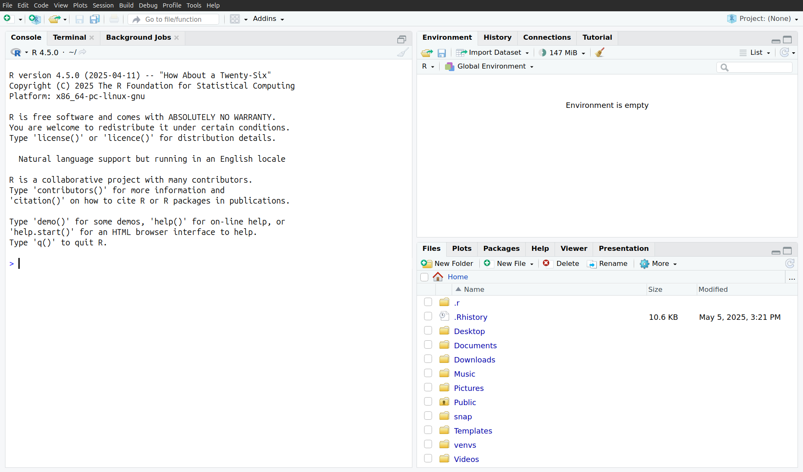

2. Copy and paste following commands in the console window and type enter

```{r, message=FALSE, warning=FALSE}
library(QFeaturesGUI)
library(msqrob2gui)
options(shiny.maxRequestSize = 500 * 1024^2)
```

- The first line will load the `QFeaturesGUI` package and its 
  dependencies (including `QFeatures`)
- The second line will load the `msqrob2gui` package and its
  dependencies (including `msqrob2`)
- The last line will increase the available the maximal RAM usage by 
  the application to 500 MB.

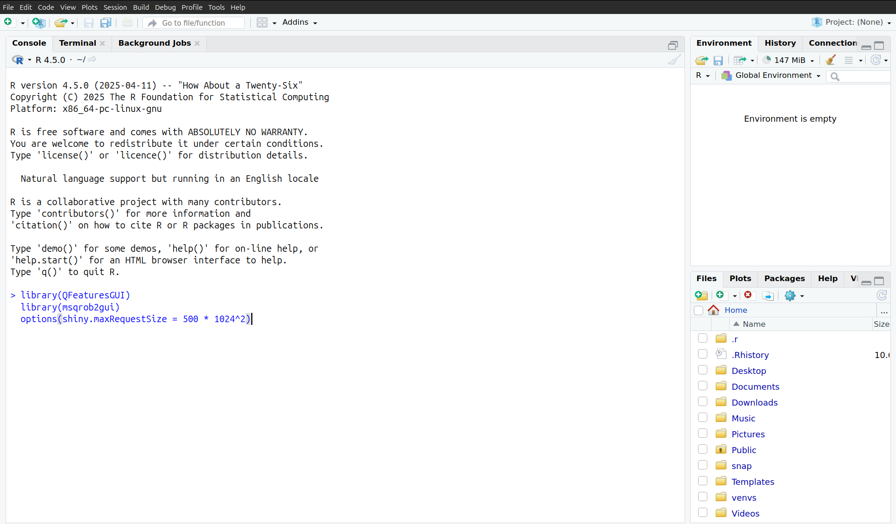

## Data preprocessing

Before analysing the data, we must perform data preprocessing. The
will ensure the data meet our model assumptions. Data import and
preprocessing is performed by the `QFeaturesGUI` application.

### Open `QFeaturesGUI` 

Run the following command (like above):

```{r, eval=FALSE}
QFeaturesGUI::importQFeatures()
```

A new window will open with the shinyApp

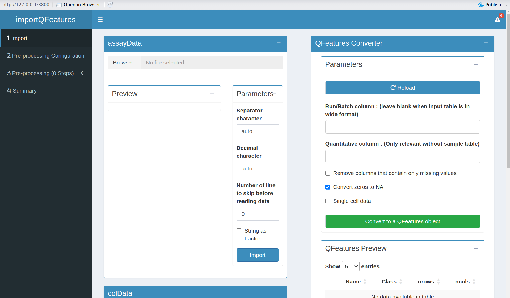

It is advicable to open the shiny app in a webbrowser. You can do
that by clicking on the button `Open in Browser`, which you can find
above the blue navigation bar and the shinyApp will pop up in a new
browser tab/window.

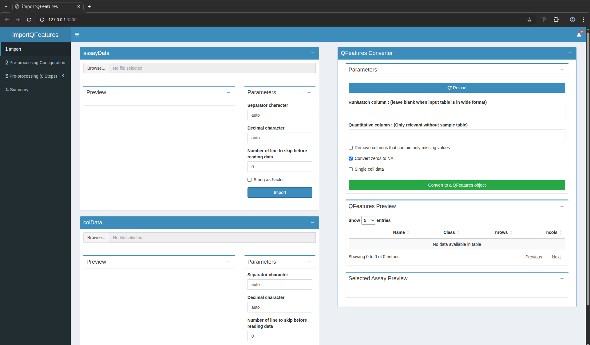

### Import the data

Our MS-based proteomics data analysis workflows always start with 2 
pieces of data: 

1. The search engine output. In this tutorial, we will use the
   identified and quantified peptide data by MaxQuant, called
   `peptides.txt`.
2. An annotation file describing the experimental design. Each line
   corresponds to a sample and each column provides a sample 
   annotation.

The first step is to upload the `peptides.txt` file. This is the file
that contains your peptide-level intensities. Note that the
intensities measured in each sample are stored in a separate column
and each row represents a peptide. This means that MaxQuant already
performed aggregation of PSM-level data into peptide-level data. For
more control on PSM-level quality control and data aggregation, our
data analysis workflows can also start from the `evidence.txt` files
which contain PSM-level information, but will not be covered in this
tutorial. For a MaxQuant search, the `peptides.txt` file can be found
by default in the `path_to_raw_files/combined/txt/` folder from the
MaxQuant output, with `path_to_raw_files` the folder where raw files
were saved. To upload the `peptide.txt` file, click on the "Browse..."
button under the "assayData" tile title. You don't need to adapt the
default parameters, you can click the "Import" button right away. A
preview of the table will appear and will let you quickly check the
data.

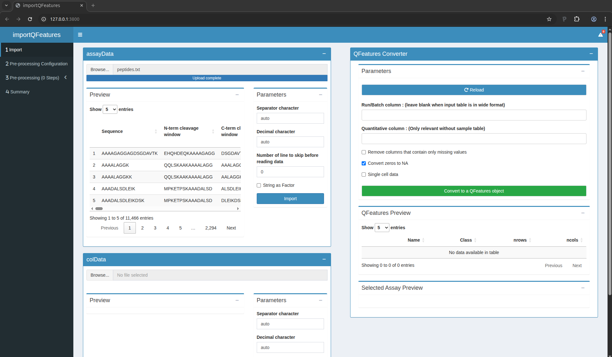

You can see that MaxQuant generated a table with 11,466 lines,
corresponding to 11,466 peptides. For each peptide, MaxQuant generated
71 columns containing various pieces of information, like the peptide
sequence, the protein groups the peptide matches to, the charge states
found,... Among these columns, there is also a set of columns
containing the quantified MS intensities for each sample (i.e. columns
named `Intensity XXX`). These will later be flagged as quantitative 
information.

Similarly, we need to upload the experimental annotation file which is
called `experimental_annotation.txt`. We here provide the table as a
`.txt`, but you can store your table in many common formats, such as
`.csv` or `.tsv`. Note Excel allows you to store spreadsheets in such
formats. To upload the `experimental_annotation.txt` file, click on
the "Browse..." button under the "colData" tile title. You don't need
to adapt the default parameters, you can click the "Import" button
right away. A preview of the table will appear and will let you
quickly check the data. Note that uploading the annotation file is
optional for data preprocessing, but you won't be able to perform data
modelling in the next section.

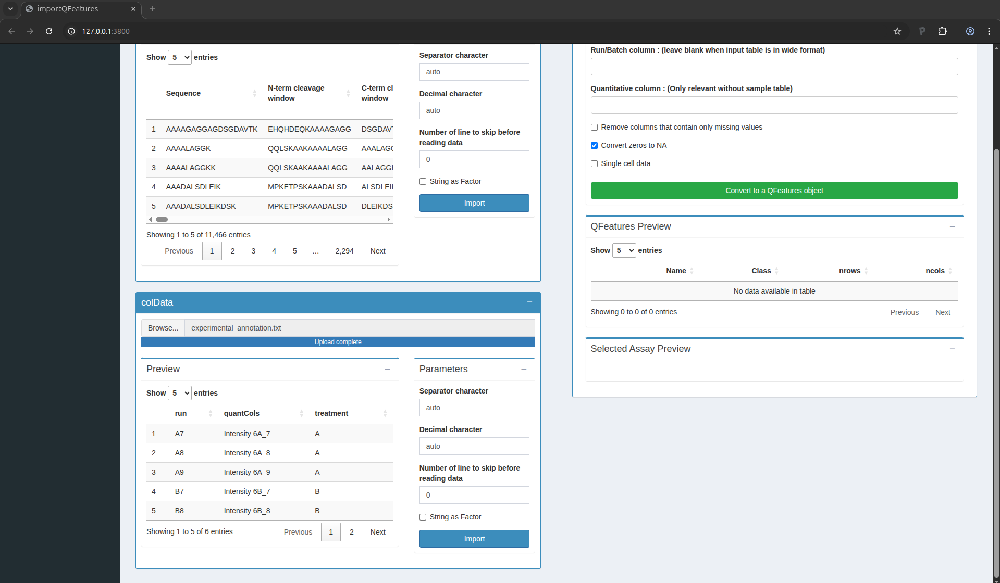

For the CPTAC dataset analysed with MaxQuant, the first column equals
the names given in MaxQuant’s "Experiment" column. The second column
contains the names of the quantitative columns in the table above; it
should always be named `quantCols` as it will allow the software to
correctly link the two tables. The last column is related to the study
design; here the treatment provides the spike-in condition.

You are now ready to link the two tables into a `QFeatures` object,
which is the internal representation of the data we will use for the
rest of the workflow. Scroll up to the "QFeatures Converter" tile. You
can leave all the default setting and click on the green button
"Convert to a QFeatures object".  

After uploading your files, a preview of the data appears (feel free
to click on the table row). The window should look as follows:

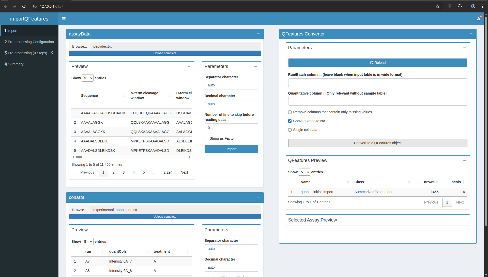

### Configuring the preprocessing worflow

Move to the next table by clicking on "Pre-Processing Configuration"
in the menu to the left. Click on the green button "+" to add a step.
In this tutorial, you will need to add 7 steps in total. You should
parameterise them as follows:

1. Log Transformation
2. Add Annotations
3. Features filtering
4. Normalisation
5. Aggregation
6. Add Annotations
7. Features filtering

Once done, your screen should look as follows:

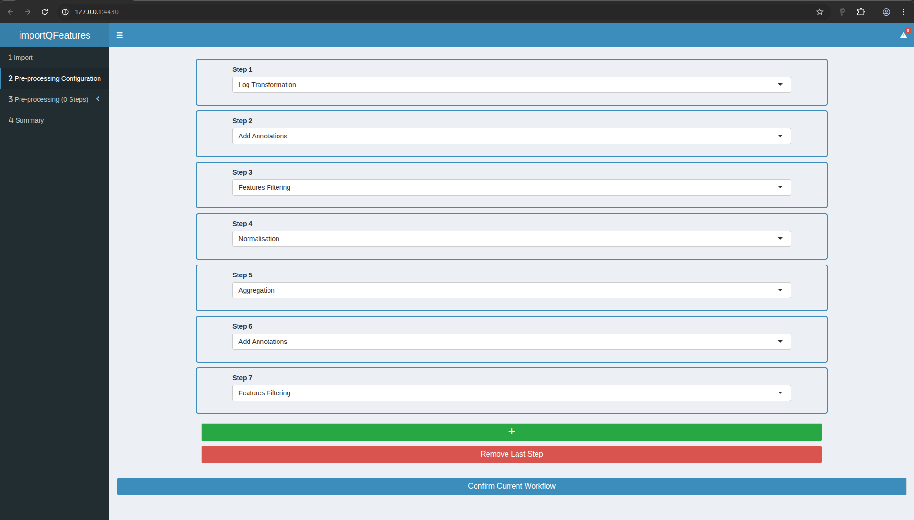

You can now click the "Confirm Current Workflow" button. On the left
menu, you will see that the 3rd entry now mentions "3 Pre-processing
(7 Steps)". We will now configure and run each of these steps.

### Step 1: Log transformation

For every step, you always need to load the data from the previous
step (in this case the data importation). Click on the "Load assays
from previous step" button. Once loaded, the data is automatically
log2-transformed by default. You should not change the defaults. You
will see that the intensity distribution within each sample is
automatically pictured, and you can play with the plot setting (bottom
right) as you wish. Your screen should be similar to this: 

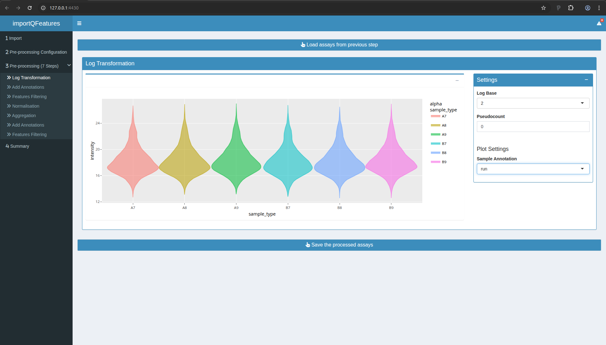

Once you are done, click the "Save the processed data" button. This
will store the changes and make the data available for the next step.
If you forget to click this button, loading the next step will lead to
an error.

### Step 2: add annotations

In Step 3, we will filter out features based on then number of missing
values. This information is not yet available in our data for
filtering, so we will add this information as a feature annotation.

1. Move to Step 2 in the left menu.
2. Click the button to load the previous step. 
3. Scroll at the bottom an tick the "Add missing values numbers" box
4. Click "perform annotation". You should see a preview of the feature
   annotations. You can check that the last column is "nNA" which 
   provides the number of missing values.
5. Click the button to save the processed data.

### Step 3: peptide filtering

In this step, we will actually remove undesirable peptides. We will
use the following criteria:

- Remove peptides that could not be mapped to a protein. In the peptides.txt file of MaxQuant the variable Proteins consists of an empty character: `Proteins != ` 
- Remove reverse sequences (decoys). In the peptides.txt file of MaxQuant the variable Reverse is an empty character for forward sequences (targets) and an "+" character for reverse sequences: `Reverse != +`
- Remove contaminants. In the peptides.txt file of MaxQuant the variable "Contaminants" or "Potential.contaminant" an empty character for non-contaminant sequences and a "+" character for contaminant sequences: `Potential.contaminant != +`
- Remove peptides that were identified in less than three sample. There are 6 samples so there number of NA's has to be smaller or equal to: `nNA <= 3`

To perform this filtering and carry out the sep, you can:

1. Move to Step 3 in the left menu.
2. Click the button to load the previous step. 
3. Click 4x the blue "Add Box" button to add 4 filtering boxes.
4. Fill in the boxes as shown in the figure below.
5. In the "Filtering Summary" tile, click the "Apply Filters" button.
6. Click the button to save the processed data.

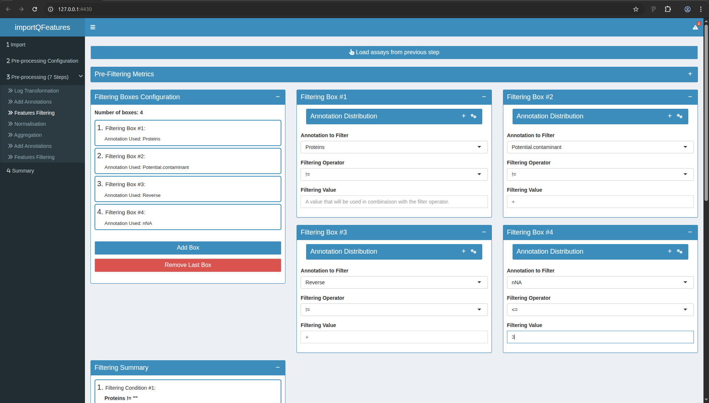

### Step 4: Normalisation

We normalise the data by substracting the sample median from every
intensity for peptide $p$  in a sample $i$:

$$y_{ip}^\text{norm} = y_{ip} - \hat{\mu_i}$$

with $\hat\mu_i$ the median intensity over all observed peptides in
sample $i$.

1. Move to Step 4 in the left menu.
2. Click the button to load the previous step.
3. Median normalisation is configured by default, so you can simply
   click the button to save the processed data.

### Step 5: Summarisation

In this step, the peptide intensities will be summarised (aka
aggregated) into protein intensities using robust summarisation. You
can perform this as follows:

1. Move to Step 5 in the left menu.
2. Click the button to load the previous step.
3. In the settings, first select "robustSummary" in the first field and
   then select "Proteins" as the rowData variable defining the features of
   the assay to aggregate.
4. Click the button to save the processed data.

### Step 6: add annotations

Repeat step 2, this will allow to perform a filtering on missing, but
at the protein-level instead of peptide-level.

### Step 7: protein filtering

In this step, we will remove proteins that were identified in less
than 4 samples so that for most proteins at least two protein-level expression values are observed in each treatment group. So we will tolerate at most 6-4 = 2 missing values at the protein-level. You may have guessed it by now, but you can proceed 
with:

1. Move to Step 7 in the left menu.
2. Click the button to load the previous step. 
3. Click 1x the blue "Add Box" button to add a filtering box.
4. Fill in the boxes so that the filter becomes: `nNA <= 2`.
5. In the "Filtering Summary" tile, click the "Apply Filters" button.
6. Click the button to save the processed data.

### Save your progress

You now have completed the data processing. You can move to the
Summary tab (in the left menu). There you will find an overview of the
data and the data processing steps.

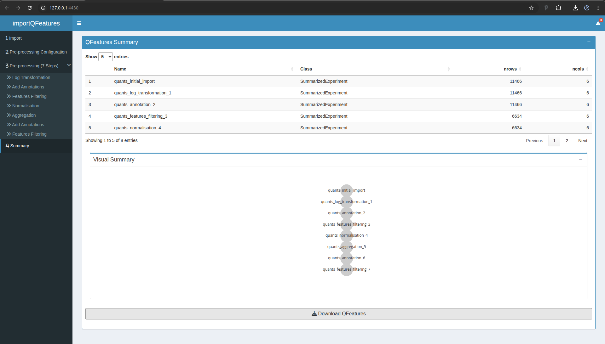

Go to the bottom of the page and click on the "Download QFeatures"
button. A pop up windown will ask you to select a directory to store
the resulting file. By default the file is called
`qfeatures_object.rds`, but feel free to rename as you wish but you
cannot change the file extension (`.rds`).

You can now close the application.

## Statistical analysis

### Open `msqrob2gui` 

Return to your Rstudio application and run the following command:

```{r, eval=FALSE}
msqrob2gui::launchMsqrob2App()
```

A new window will open with the shinyApp for data modelling

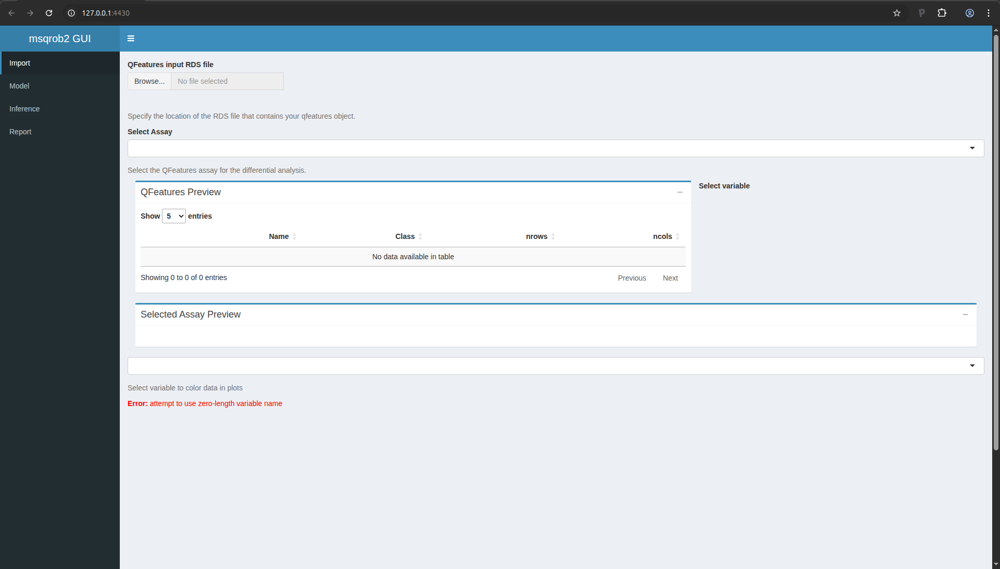

### Import the processed data

We start the data modelling workflow with importing the data processed
in the previous section:

1. Click on "Browser..." and fetch the file you saved with the
   `QFeaturesGUI` app.
2. In the "Select Assay", select the last item,
   "quants_features_filtering_7".

The application let's you explore the data tables and provides a plot
with the intensity distributions for each sample.

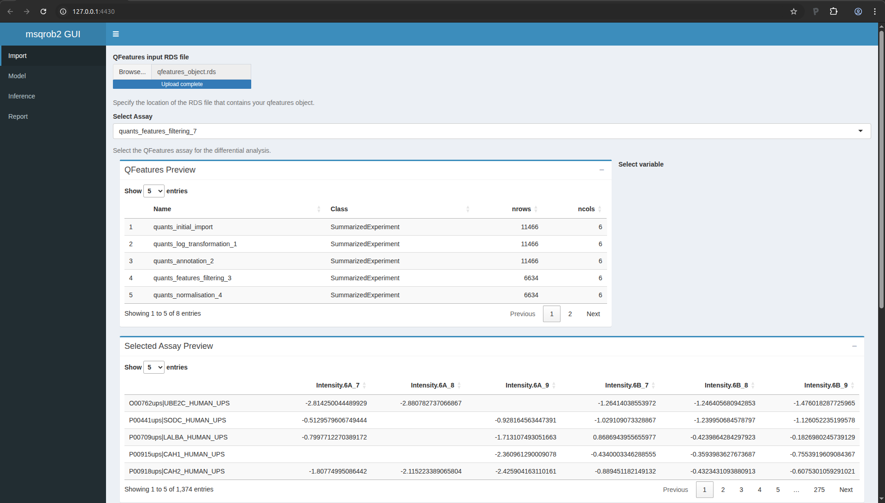

When you scroll down the page, you will find a drop down text selector
(under the table). Change "run" into "treatment" and look at the
principal component analysis (PCA) plot. How would you interpret this
graph?

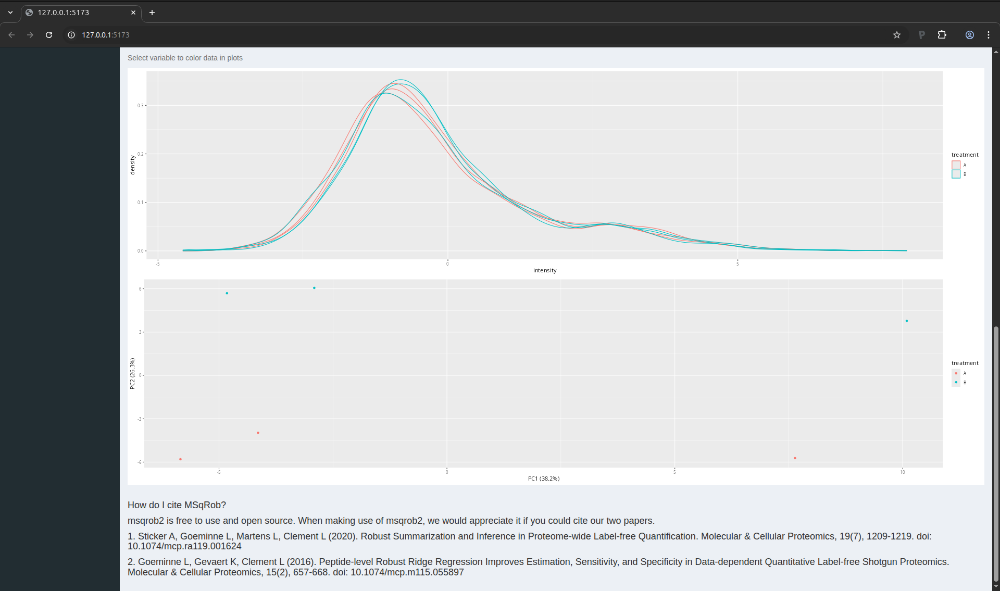

The PCA plot indicates that we can expect a treatment effect in the
data as the sample belonging to one treatment can be separated from
the samples belonging to the other treatment. We also see that this
separation mostly occurs in the second principal componen. The first
component, which explains most of the variation, does not seem to bear
correlation associated with treatment. This is expected as we know
that only a few protein were spiked in, so we do not expect an effect
of treatment for most proteins. We will now delve into the data
modelling and inference that will statistically quantify these effects
for each protein individually.

### Data modelling

You can now move to the data modelling tab by clicking "Model" in the
menu on the left. 

We will model the data with a different group mean for the variable
`treatment` with two levels: spikein treatment A and B. We can specify
this model by inserting `~1+treatment` in the "Design formula"
textbox. Note, that a formula always starts with a symbol '~' (see the
descriptive paragraph in the application).

Note that as soon as we do that, the design is visualised. 

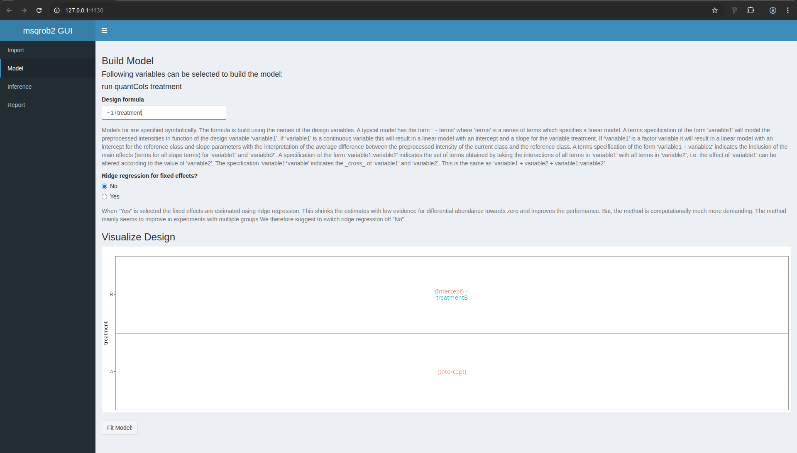

This visualisation shows the different group means that are modelled. 

- The group mean for the treatment A is modelled using the parameter 
  `(Intercept)`. 
- The group mean for the treatment B is modelled using a linear 
  combination of the two model parameters `(Intercept) + treatmentB`.
- The average difference in preprocessed protein expression value 
  between both conditions equals `treatmentB`.

Remember that we log-transformed the intensities:

$$ 
\log_2FC_\text{B}=\log_2 B - \log_2 A = \log_2\frac{B}{A} = \text{treatmentB}
$$

Note that a linear combination of model parameters is also referred to
as a contrast in statistics. This contrast has the interpretation of a
log2 fold change between condition B and condition A. Positive
estimates denote that the abundance of the protein is on average
higher in condition B, negative estimates denote that the abundance is
on average higher in condition A. An estimate equal to 0 indicates
that the estimated abundances are equal.

A log2 FC = 1 indicates that the average abundance in condition B is 2
x higher than the average abundance in condition A, i.e. an 2 fold
upregulation in condition B as compared to condition A.

We now have to click the `Fit Model!` button to fit the models for
each protein. We are now ready for assessing differential abundance of
each protein using formal hypothesis testing.

### Inference

Click on the "Inference" tab in the left menu.

In the statistical analysis we will want to test the null hypothesis
that

$$ H_0: \log_2 B-\log_2 6A = 0 $$

Against the alternative that

$$ H_1: \log_2 B - \log_2 A \neq 0 $$

We can specify the null hypothesis as a linear combination of the
model parameters, i.e. `treatmentB = 0`. We will falsify this null
hypothesis for each protein separately based on the linear model. So,
under the null hypothesis we reason that there is no effect of the
spike-in treatment on the abundance of a specific protein. The p-value
of the statistical test than indicates the probability to observe an
effect (fold change), that is as extreme or more extreme (equally or
more up or down regulated) than what is observed in the sample, by
random change (when the null hypothesis is true and when there is in
reality no effect of the treatment).

To proceed, fill in the field "Null hypothesis" with `treatmentB = 0`.
After 1-2 second, the window is updated 

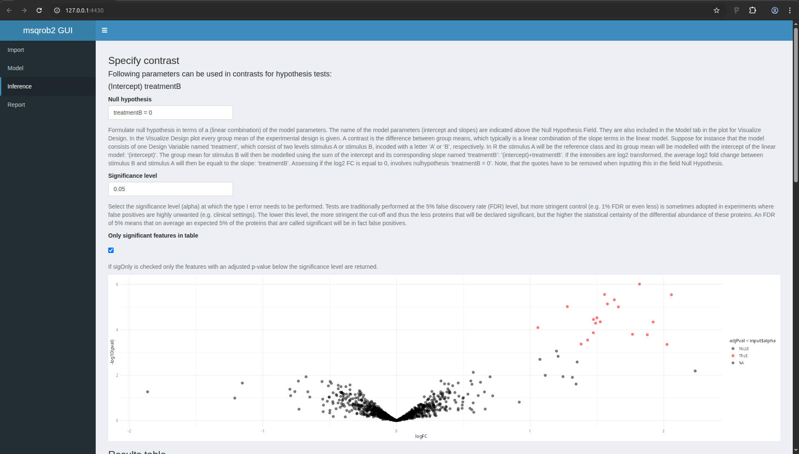

#### Volcano plot

The application now also provides a volcano plot appears giving you a
view on statistical significance in the y-axis, i.e. the $-\log_{10}$
transformed p-value: a value of 1 equals to a p-value of 0.1, a value
of 2 equals a p-value of 0.01, etc against biological relevance/the
effect size in the x-axis, which is the $\log_2FC$.

#### Result table

You also get a table with selected feature. By default these are all
proteins that are significant with the specified "Significance level"
field. You also obtain a boxplot of the log2-fold changes for all
proteins that are selected in the table.

Note that 19 proteins are recovered as significant. As expected all
these proteins are UPS proteins which are known to be spiked in the
samples. If you untick the option `only significant features in
table`, all proteins are shown in the table.

You can highlight proteins on the volcano plot by selecting lines of
interest in the result table. You can also search for specific
proteins in the list by using the search field above the table. E.g.
type `ups`.

#### Detail plots

If you select one protein in the table, you can also explore the
underlying normalised peptide intensities and protein intensities of
the underlying data in the "DetailPlots":

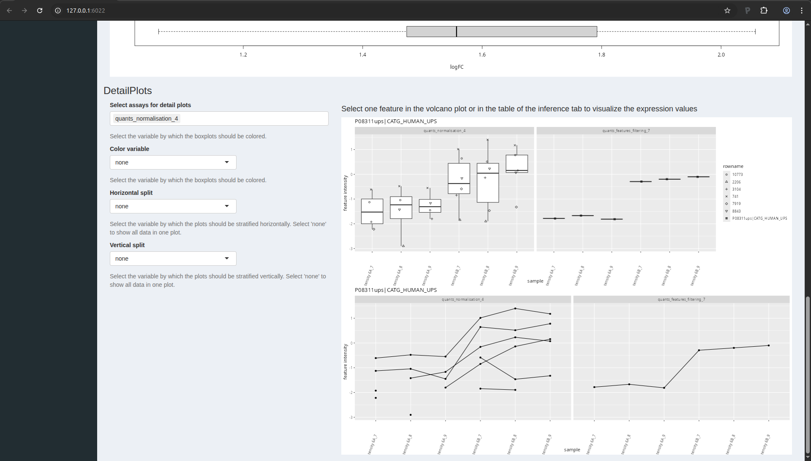

You can further modify the plot by coloring the data according to a
design variable or by splitting the data horizontally or vertically
according to design variables.

## Report Tab

A reproducible Rmarkdown script and html report with the analysis you
performed with the GUI can be downloaded in the "Report" tab.

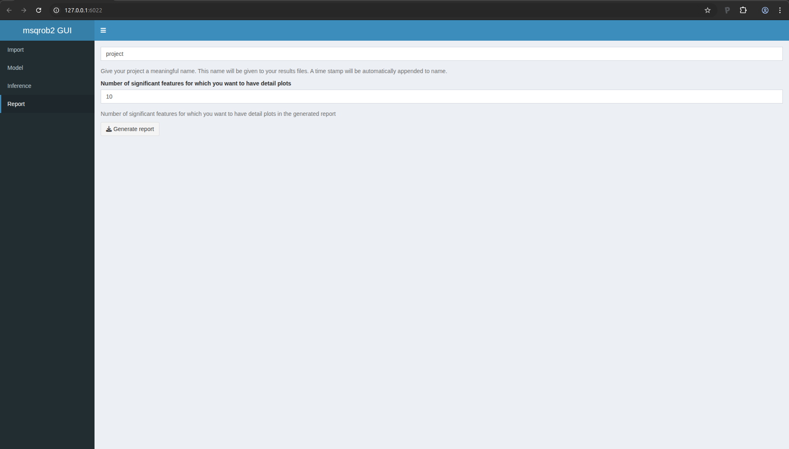

1. Provide a name to your project
2. You can specify the number of detail plots you want to generate in
   the report. The default is 10, which indicates that detail plots
   will be constructed for the 10 most significant protein in your top
   list. Note, that the number of detail plots can be smaller if there
   are less than 10 proteins significant at the specified FDR-level.
3. Click the "Generate report" button and a report will be compiled.

This will create a zip file that contains:

- `qfeaturesFile.rds`: A tab delimited file with the raw intensity 
  data.
- `report.Rmd` : R/markdown file with the code for the report. If you
  open the file in Rstudio and if you hit the knit button the report
  will be compiled to html.

So, your analysis is stored in a fully reproducible way. 

## Wrap up exercise: evaluate summarisation

We further explore the difference between summarisation methods. We
first assess the quality of the fold change estimates for the robust
summarisation. 

Go back to the "Inference" tab. We will make use of the boxplot at the
bottom of the quantification tab.

1. Untick the option `only significant features in table` to show all
   proteins in the table. The boxplot below the table visualises the
   log2 fold change (FC) estimates for all proteins in the table.
2. We can now filter the ups proteins by typing "ups" in the search
   field above the table. Now all yeast proteins are removed from the
   results table and a boxplot of the ups protein log2 FCs will be
   made.

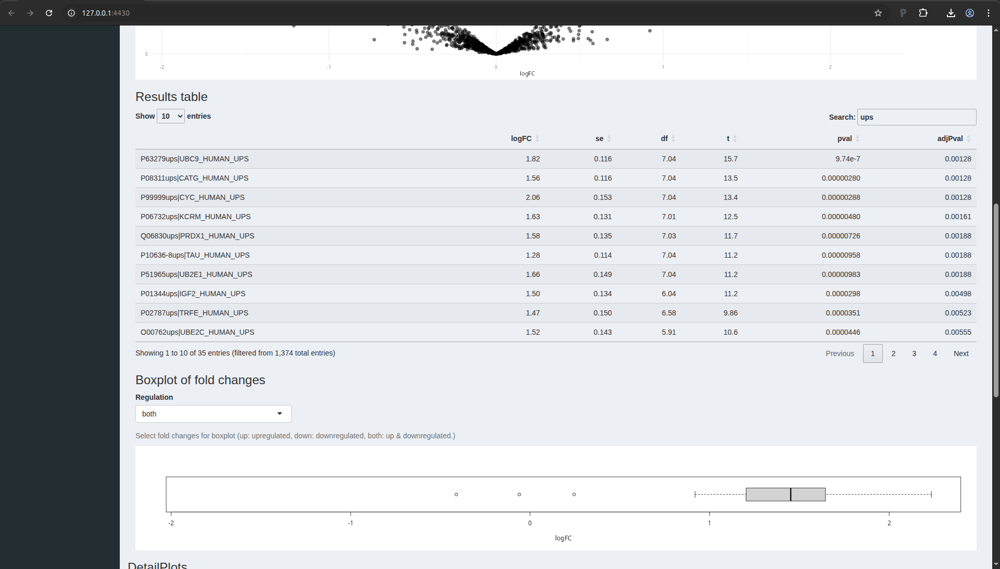

Try answering the following questions:

- We know the real FC for the spike in proteins (see
  description of the data 2.2). Note, that the boxplot is showing the
  log2 FC. What do you observe?
- Now select all yeast proteins. What is the real fold change
  and what do you observe?
- Close and reopen the ahiny App and repeat the complete analysis, but this time apply the median summarisation method in Step 5 in the data preprocessing. What do
  you observe, how does that compare to the robust summarisation and
  try to explain this?

## Final remark

Note, that the shiny apps are interfaces to the statistical
programming software R.

The analysis can also be conducted using scripts, which gives you much
more functionality and the ability to streamline, automate and
document your analyses in a reproducible way.
