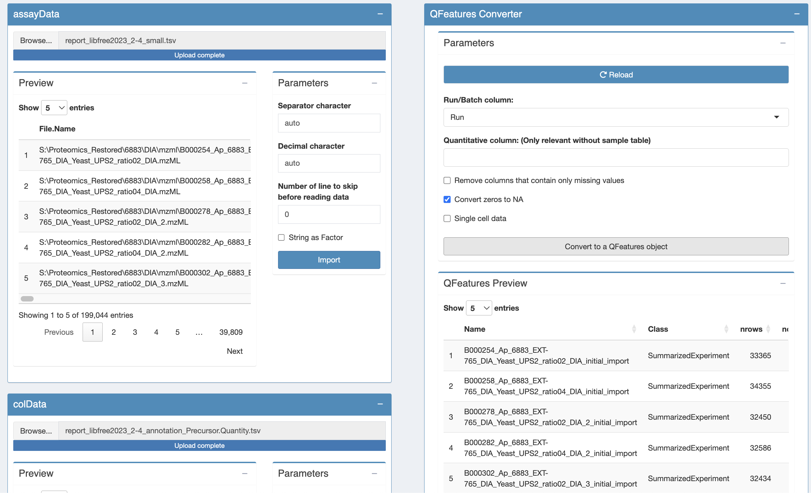
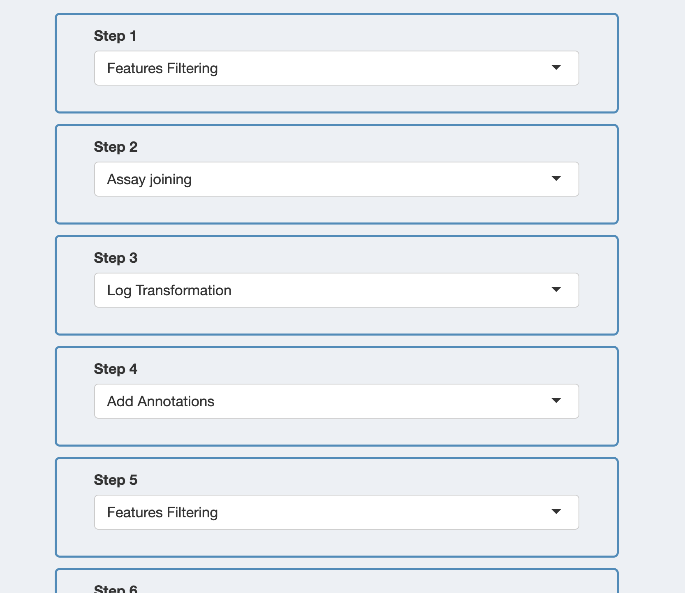
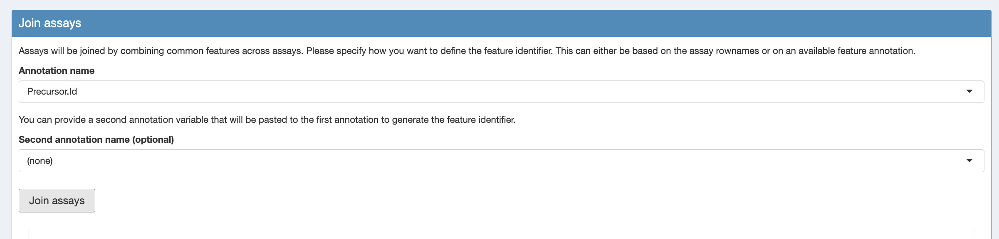

<a rel="license" href="https://creativecommons.org/licenses/by-nc-sa/4.0"></a>

## The UPS DIA Spike in A vs B dataset

The DIA case-study is a subset of Staes et al. [@Staes2024]. 
They spiked digested UPS proteins at five different concentrations in a yeast digest background. 
We will only use the data of two spikin concentrations, which we refer to as condition A and B. 

- The subset of the dia-nn data can be downloaded [zip file with 
  data](https://github.com/statOmics/PDA25EBI/archive/refs/heads/data.zip).
  The report file can be found in 
  `data/quantification/ups_spikein_dia-nn`.
  
If you use the GUI for the first time we suggest to first follow the DDA cptac vignette study prior to this DIA vignette: [cptac vignette](./cptac_robust_gui.html). 


## Data preprocessing

Before analysing the data, we must perform data preprocessing. The
will ensure the data meet our model assumptions. Data import and
preprocessing is performed by the `QFeaturesGUI` application.

### Open `QFeaturesGUI` 

Run the following command (like above):

```{r, eval=FALSE}
QFeaturesGUI::importQFeatures()
```


### Import the data

Our MS-based proteomics data analysis workflows always start with 2 
pieces of data: 

1. The search engine output. In this tutorial, we will use the
   identified and quantified peptide data by DIA-NN, called
   `peptides.txt`.
   
2. An annotation file describing the experimental design. Each line
   corresponds to a sample and each column provides a sample 
   annotation.

The main difference with the peptide.txt file of MaxQuant is that the DIA-NN report file is a flat file while the MaxQuant peptide.txt file is a wide file. 

This will involve an additional step in the data preprocessing. 

When importing a flat file in the QFeaturesGUI will store the data of each run in a separate assay. 

We will then join the assays of each of the runs in a separate assay. 

Similarly as in the CPTAC vignette, we will 

1. first import the DIA-NN data in the assayData tab: `report_libfree2023_2-4_small.tsv` and 
2. The corresponding experimental annotation file `report_libfree2023_2-4_annotation_Precursor.Quantity.tsv` in the colData tab. The annotation file contains a variable quantCols that refers to the Precursor.Quantity column from DIA-NN, which provide the MS2 quantifications. If you want to work with the MS1 quantifications you need to use `Ms1.Area` in the variable quantCols (see report_libfree2023_2-4_annotation_Ms1.Area). Because the DIA-NN report file is a flat file the annotation file also have to provide a column with the information of the run names in the annotation file. The name of the latter column has to be `runCol`. 

3. Finaly we import the data in a QFeatures object using the QFeatures converter tab. 
Note, in the QFeatures tab we also have to indicate the name of the run column in the assayData for files in a flat format. For DIA-NN data this column is named `run`.



Note, that multiple assays are created. One for each run. 

### Configuring the preprocessing worflow

Move to the next table by clicking on "Pre-Processing Configuration"
in the menu to the left. Click on the green button "+" to add a step.
In this tutorial, you will need to add 9 steps in total. 
Two steps more then for the cptac vignette: 

- An additional feature filtering step to retain precursors that have not been identified, which have a low Q value (low FDR for identification) or a low protein group Q value. 

- A step to join the assays of the different runs in a single assay. 

You should
parameterise them as follows:

1. Feature filtering
2. Join assays
3. Log Transformation
4. Add Annotations
5. Features filtering
6. Normalisation
7. Aggregation
8. Add Annotations
9. Features filtering


You can now click the "Confirm Current Workflow" button. On the left
menu, you will see that the 3rd entry now mentions "3 Pre-processing
(9 Steps)". We will now configure and run each of these steps.




### Step 1: Feature filtering 

Note that the PCA plots will fail because every run only contains information about 1 run. 

Add three filtering boxes. 

1. Box to retain precursors that have been identified: `Precursor.Id != ` 
2. Box to retain precursors with a Q-value below 0.01: `Q.Value <= 0.01`
3. Box to retain precursors with a Q-value below 0.01: `PG.Q.Value <= 0.01`

Then we perform the filtering and save the assay: 
4. Click `apply filters`
5. Click `save the processed assays`

### Step 2: Assay joining

1. Click `Load assays from previous steps`
2. Select the `Precursor.Id` column as the annotation name
3. Click `join assays`
4. Click `save the processed assays`



### Step 3: Log transformation

Similar to the cptac vignette we log transform the data. 

Once you are done, click the "Save the processed data" button. 

### Step 4: add annotations

Similar to the cptac vignette we add the annotation on the missing values. 

### Step 5: precursor filtering

1. We filter the precursors based on the number of NAs. 
Again we want only precursors that were observed in at least 3 runs so nNA has to be smaller or equal to than 6-3 = 3 . 
`nNA <= 3`

2. With DIA-NN you can keep the precursors that only map to one protein: 
`Proteotypic == 1`
3. In the "Filtering Summary" tile, click the "Apply Filters" button.
4. Click the button to save the processed data.


### Step 6: Normalisation

Again we normalise the data as in the previous vignette by using median centering. 

### Step 7: Summarisation

Again we summarize the data as in the previous vignette us `Protein.Ids` to aggregate the precursor-level data in a protein-level expression value. 

### Step 8: add annotations

Repeat step 2, this will allow to perform a filtering on missing, but
at the protein-level instead of peptide-level.

### Step 9: protein filtering

Again, we will remove proteins that were identified in less
than 4 samples so that for most proteins at least two protein-level expression values are observed in each treatment group. 

So we will tolerate at most 6-4 = 2 missing values at the protein-level. 

### Save your progress

You now have completed the data processing. You can move to the
Summary tab (in the left menu). There you will find an overview of the
data and the data processing steps.

Go to the bottom of the page and click on the "Download QFeatures"
button. A pop up windown will ask you to select a directory to store
the resulting file. By default the file is called
`qfeatures_object.rds`, but feel free to rename as you wish but you
cannot change the file extension (`.rds`).

You can now close the application.

## Statistical analysis

### Open `msqrob2gui` 

The differential analysis in the msqrob2gui remains similar to the previous vignette and tutorials. 
